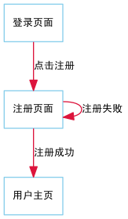
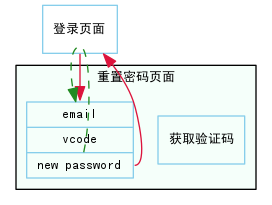

# 1.引言

本文是电信学院物资平台的设计说明书。

按流程，应该是先有概要设计，再有详细设计，
但由于工期紧张，文档编写者缺乏经验等原因，
本设计说明书把两步合为一步，固称作设计说明书。

## 1.1 编写目的

本文的对象是平台开发者，为他们提供一个详细的开发指引。

## 1.2 项目背景

本平台是为电信学院学生会更加方便管理物资而建设。

## 1.3 定义

平台：电信学院物资管理平台
本文、说明书：电信学院物资管理平台设计说明书
开发者：平台开发者

## 1.4 参考资料

电信学院物资平台 V1.0 产品需求说明书

# 2. 任务概述

## 2.1 目标

编码实现电信学院 V1.0 版本。

## 2.2 运行环境

LNMP——Linux,Nginx,MySQL,PHP

## 2.3 需求概述

实现物资申请、物资信息修改等功能。

## 2.4 条件和限制

在寒假(2015.01.16-2015.03.01)之内完成。

# 3. 总体设计

## 3.1 功能架构

平台包括申请/审核系统和管理系统两部分，主要有：

- 用户登录/登出
- 用户管理
- 主页
- 物资申请/审核
- 工作室申请/审核
- 物资管理
- 工作室管理
- 用户通信

## 3.2 系统架构

本平台采用MVC的3层架构，主要包括：表现层、控制层、业务层。

表现层：主要负责用户交互和结果显示。
控制层：主要负责系统的控制访问、数据加载。
业务层：主要负责系统和数据库的交互。

用户 ←→ 表现层 ←→ 控制层 ←→ 业务层 ←→ 数据库

## 3.3 模块设计

### 3.3.1 登录模块

登录模块主要用于用户登入和登出。

#### 用户登入

#### 用户登出

### 3.3.2 用户模块

用户模块有注册、找回密码、更改密码、更改用户信息等功能。

#### 用户注册

#### 找回密码

### 3.3.3 主页模块

主页模块是用户登录后的页面，包含

- 用户信息
- 申请/审核记录，包含两部分，自己个人的和所有人的，按时间排序，点击切换
- 物资列表

### 3.3.4 物资审核模块

本模块有查看审核列表、查看详情、通过申请、拒绝申请等功能。

#### 审核列表

审核员可以在此页面查看所有未审核的物资申请。

#### 查看详情

审核员可以在此页面查看某一物资申请的具体情况，
包括申请时间、申请人、申请原因、申请物品等等。

#### 通过申请

通过一个或多个申请。

#### 拒绝申请

拒绝一个或多个申请，并填写拒绝原因。
当批量拒绝时，所有都是同一拒绝原因。

### 3.3.4 物资管理模块

本模块有物资一览、添加物资、更新物资、删除物资、上传物资、添加分类、删除分类等功能。

#### 物资一览

展示所有的物资情况。

#### 添加物资

添加单个物资。

#### 删除物资

删除单个或多个物资。

#### 上传物资

上传excel文件，批量增加物资。

#### 添加分类

添加单个物资分类。

#### 删除分类

删除单个物资分类。

### 3.3.5 工作室审核模块

本模块有查看申请列表、通过申请、拒绝申请等功能。

#### 查看申请

审核员可以在此页面查看所有未审核的物资申请。

#### 通过申请

通过用户的工作室申请。

#### 拒绝申请

拒绝用户的工作室申请。

### 3.3.6 工作室管理模块

本模块暂无需求。

### 3.3.7 用户通信模块

本模块有发送通知、阅读通知、查看通知等功能。

#### 发送通知

在审核员审核结束后，系统会自动发通知给用户。
管理员也可以发通知给任何用户。

#### 查看通知

用户在此页面查看所有发给自己的信息列表。

#### 阅读通知

用户在此阅读某一通知的内容。

## 3.4 数据库设计

### 3.4.1 用户信息

#### user表

ID

username                *用户名

nickname                *昵称

password                *密码

email                   *邮箱，可以用于找回密码

phone                   *联系电话

photo                   头像（用存储url形式实现）

reskey                  重置密码

status                  判断是注册状态（registed:已注册； unregisted：未注册； deleted：已删除）

#### 角色role

admin                   管理员，相当于超级管理员状态，拥有除审核外的所有权限

checker                 审核员，拥有普通用户和审核的权限

user                    普通用户，拥有申请物资，浏览物资等基本功能

### 3.4.2 物资信息

#### material物资表

ID

name                    物资名称

number                  序号？？？（建议去掉）

type                    物资分类

sum_n                   物资数量（总数）

left_n                  该项物资余数（可去？？）

borrow_n                物资借出数量

create_time             物资生成时间

update_time             物资更新的时间

description             对物资的描述（备注）

status                  （留用）

comment                 （留用）

### 3.4.3 申请/审核表

#### check表

ID

user_id                 用户id

checker_id              审核者id

reason                  申请原因/审核原因

request_time            申请时间

response_time           审核时间（即为审核员回应的时间）

borrow_time             借出时间（或预计借出时间）

return_time             归还时间（预计归还时间）

status                  物资状态（pass：审核通过； refuse：拒绝通过；  waiting：未审核 ）

#### apply_resouce表

ID

apply_id

resource_id             物资的id号

number                  数量

comment                 备注

### 3.4.4 工作室/会议室表

和物资的表可重用

### 3.4.5 通知信息

#### notice表

ID

from_user               来自哪个用户

content                 通知内容

push_time               通知推送的时间

#### notic_to_user表

ID

notice_id               通知（notice）表的id

user_id                 接收方的id

status                  消息状态（已读、未读等）                

# 4. 详细设计
